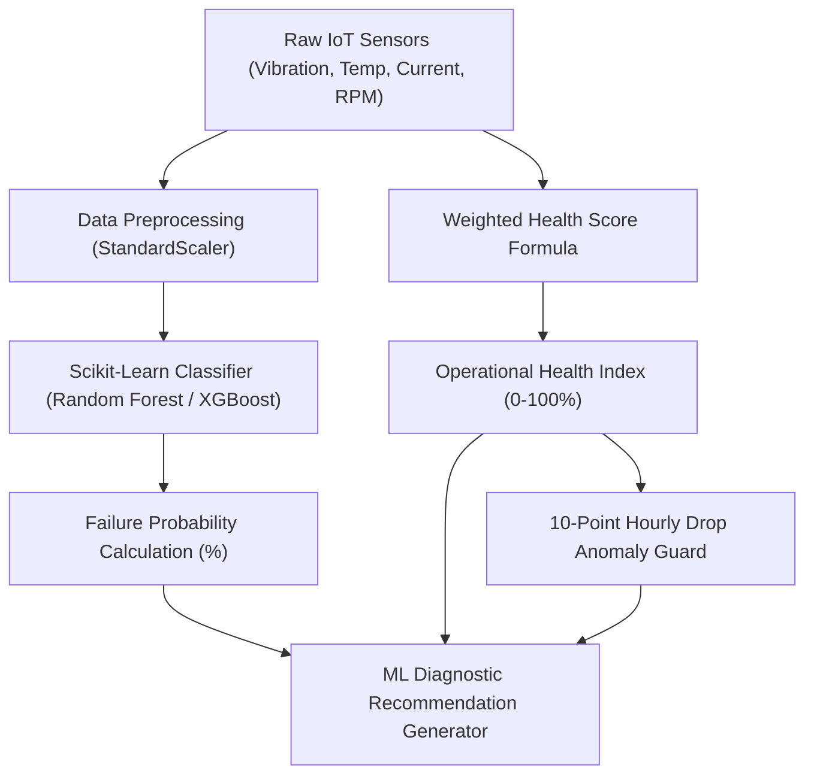
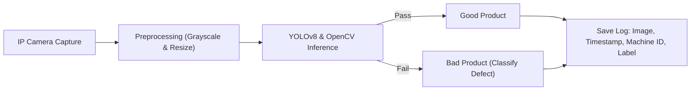
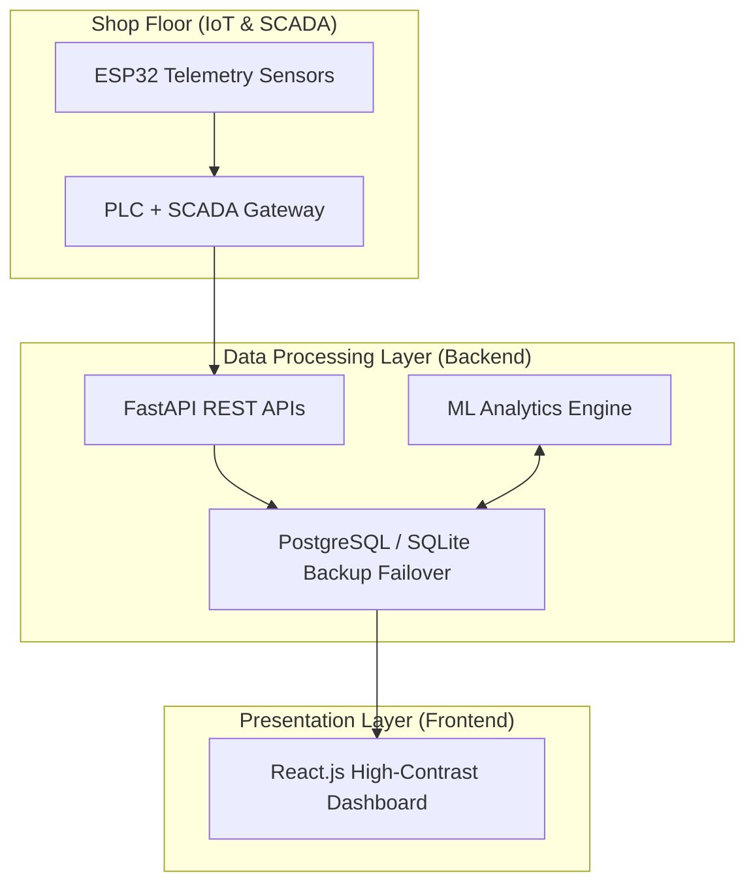

# Smart Factory Condition & Quality Dashboard
## Complete Technical Documentation & Systems Architecture

> [!NOTE]
> This document serves as the final system specification and implementation report for the Industry 4.0 Centralized Factory Dashboard prototype.

---

## 1. Executive Summary & Objective

The **Smart Factory Condition & Quality Dashboard** is an integrated Industry 4.0 management platform. It fuses **SCADA telemetry, Machine Learning diagnostics, and Computer Vision inspections** to establish real-time factory floor monitoring, automate defect discards, and predict machine breakdowns before they trigger unplanned plant downtime.

### Core Deliverables:
* **Real-time Telemetry Acquisition**: Monitoring temperature, vibration, current, RPM, and pressure.
* **Predictive Maintenance (ML)**: Custom Scikit-learn classification models forecasting failing machines.
* **Computer Vision Inspector (CV)**: Real-time part inspection identifying scratch, cracks, missing label, and wrong dimensions.
* **Role-Based Access Control (RBAC)**: Security mapping dividing views by administrative and shop floor roles.
* **Auto-Stop SCADA Integration**: Automated machine shut-downs when safety parameters drop to critical states.

---

## 2. Machine Learning Architecture (ML Pipeline)

The predictive maintenance engine forecasts hardware health degradation using a combined mathematical-statistical classifier framework.



### A. Health Score Calculation Formula
The **Operational Health Index** of a machine is calculated dynamically in the backend using the following weighted linear formulation:

\[\text{Health Score} = 40\%(V_{\text{score}}) + 30\%(T_{\text{score}}) + 20\%(I_{\text{score}}) + 10\%(R_{\text{score}})\]

Where:
* \(V_{\text{score}}\): Vibration level deviation score.
* \(T_{\text{score}}\): Temperature level deviation score.
* \(I_{\text{score}}\): Current draw deviation score.
* \(R_{\text{score}}\): Defect Reject Rate deviation score.

### B. Health Status Classification
* 🟢 **Healthy (>80%)**: Safe operational levels; standard preventive schedules active.
* 🟡 **Warning (60% - 80%)**: Minor vibration/temperature anomalies; maintenance recommended in next 48 hours.
* 🔴 **Critical (<60%)**: High wear anomalies flagged; auto-stop SCADA override triggered.

### C. Predictive Failure Logic (10-Point Drop Rule)
If a machine's calculated Health Score drops by **10 points or more within a rolling 1-hour window**, the analytics engine:
1. Flags a `"Maintenance Recommended"` predictive warning.
2. Forces the Machine Status registry to `"MAINTENANCE"`.
3. Dispatches a high-priority dashboard alert notification.

---

## 3. Computer Vision Inspection Architecture

The Vision inspection pipeline simulates product checks along a conveyor belt using OpenCV edge analysis and YOLOv8 neural network inference.



### Supported Defect Classifications:
* **`LABEL_MISSING`**: Fails boundary matches for packaging sticker orientation.
* **`SURFACE_CRACK`**: OpenCV edge contour anomalies on metal frames.
* **`DAMAGE`**: Discrepancies in structural area ratios.
* **`WRONG_COLOR`**: RGB pixel range deviations.
* **`WRONG_PACKAGING`**: Dimension ratio mismatch.
* **`WRONG_DIMENSION`**: Spindle misalignment detection.

---

## 4. Systems Architecture & Data Flow



### Database Schema Design (Relational DB)
1. **Users Table**: Stores `username`, `email`, `role`, `emp_id`, `shift_zone`, and `clearance_level`.
2. **Machines Table**: Stores registry details, locations, and operational statuses (`OPERATIONAL`, `MAINTENANCE`, `OFFLINE`).
3. **SensorData Table**: Time-series log containing temp, vibration, pressure, current, and anomaly flags.
4. **Predictions Table**: Holds ML diagnostic logs, failure probabilities, and recommendations.
5. **QualityInspections Table**: Holds OpenCV image paths, defect categories, and confidence yields.
6. **Alerts Table**: Stores active warnings and acknowledgement logs.

---

## 5. Security & Access Control (RBAC Matrix)

The application enforces strict **Role-Based Access Control** at both the presentation level (hiding menu tabs) and routing guard level (blocking manual URL overrides).

| Dashboard Page | Allowed Roles | Access Description |
| :--- | :--- | :--- |
| **Executive View** | `ADMIN`, `MANAGER` | High-level aggregate metrics, OEE gauges, and alert logs. |
| **Production Analytics** | `ADMIN`, `MANAGER` | Throughput numbers, reject ratios, and hourly shift OEE line-graphs. |
| **Quality Control** | `ADMIN`, `MANAGER` | Yield pass rates, defect donut charts, and CV camera controls. |
| **Maintenance AI** | `ADMIN`, `ENGINEER`, `OPERATOR` | Real-time diagnostic triggers and ML recommendation outputs. |
| **Custom Analytics** | `ADMIN`, `MANAGER` | Dynamic sensor wave trackers (vibration, temp, pressure trends). |
| **AI Assistant** | `ADMIN`, `MANAGER`, `ENGINEER`, `OPERATOR` | Natural language Text-to-SQL helper utilizing Gemini. |
| **Corporate Reports** | `ADMIN`, `MANAGER` | One-click CSV exporter for daily OEE and downtime summaries. |

---

## 6. Verification & Setup Instructions

### Backend Setup:
1. Initialize virtual environment:
   ```bash
   python -m venv venv
   source venv/Scripts/activate
   pip install -r requirements.txt
   ```
2. Run database setup & pre-seed (adds the **1,540 starting quality logs**):
   ```bash
   python backend/app/initial_seed.py
   ```
3. Start Uvicorn backend:
   ```bash
   uvicorn backend.app.main:app --port 8085 --reload
   ```

### Frontend Setup:
1. Install dependencies:
   ```bash
   cd frontend
   npm install
   ```
2. Start Vite development server:
   ```bash
   npm run dev
   ```
3. Access local dashboard at: **`http://localhost:3000`** (or port specified in console).
